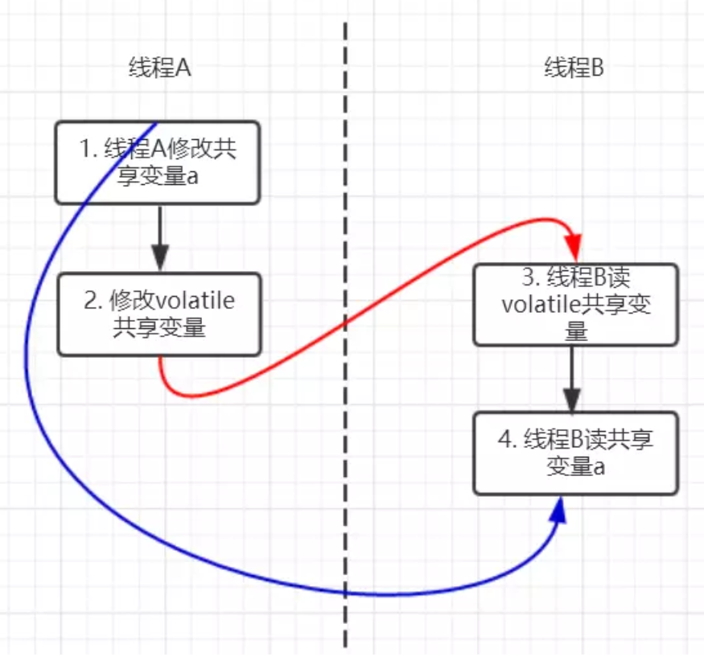

<!-- TOC -->

- [1. java多线程编程](#1-java多线程编程)
  - [1.1. 多线程编程的问题以及解决](#11-多线程编程的问题以及解决)
- [2. 一个线程的生命周期](#2-一个线程的生命周期)
  - [2.1. 新建状态](#21-新建状态)
  - [2.2. 就绪状态](#22-就绪状态)
  - [2.3. 运行状态](#23-运行状态)
  - [2.4. 阻塞状态](#24-阻塞状态)
  - [2.5. 死亡状态](#25-死亡状态)
- [3. 线程的优先级](#3-线程的优先级)
- [4. 创建一个线程](#4-创建一个线程)
- [5. 阻塞一个线程](#5-阻塞一个线程)
- [6. 如何启动新的线程](#6-如何启动新的线程)
- [7. 实例](#7-实例)
- [8. 线程调度器](#8-线程调度器)
- [9. 线程Thread类的方法](#9-线程thread类的方法)
- [10. synchronized关键字](#10-synchronized关键字)
- [11. volatile关键字整理](#11-volatile关键字整理)
  - [11.1. volatile的实现原理](#111-volatile的实现原理)
    - [11.1.1. lock指令](#1111-lock指令)
    - [11.1.2. 缓存一致性](#1112-缓存一致性)
  - [11.2. volatile有序性实现](#112-volatile有序性实现)
    - [11.2.1. volatile的happens-before关系](#1121-volatile的happens-before关系)
    - [11.2.2. volatile禁止重排序](#1122-volatile禁止重排序)
  - [11.3. volatile的应用场景](#113-volatile的应用场景)
    - [11.3.1. 状态标志](#1131-状态标志)
    - [11.3.2. 一次性安全发布](#1132-一次性安全发布)
    - [11.3.3. 独立观察](#1133-独立观察)
    - [11.3.4. volatile bean模式](#1134-volatile-bean模式)
    - [11.3.5. 开销较低的读-写锁策略](#1135-开销较低的读-写锁策略)
    - [11.3.6. 双重检查(double-checked)](#1136-双重检查double-checked)
- [12. 描述java创建线程](#12-描述java创建线程)
- [13. 参考](#13-参考)

<!-- /TOC -->
**java学习笔记之线程**
1. 多线程是实现多任务的一种方式
2. 线程是指进程中的一个执行流程，一个进程中可以运行多个线程。
3. 进程是子一个内存中运行的应用程序，是独立的线程，它代表独立的执行代码。
4. Thread类：
    1. 来源：java.lang.Thread类
    2. 方法：
        + void join()
        + void start()
        + static void sleep()
5. 线程注意
    1. 一个线程被刚创建的时候，并没有立即开始运行
    2. 使用start()方法可以使一个线程成为可运行的，但是他不一定立即开始运行
    3. 一个线程可能因为不同的原因停止并进入就绪状态
    4. 当一个线程因为抢先机制而停止运行，它被放在可运行队列的前面

# 1. java多线程编程
1. 多线程保障了更小的资源开销
2. 为了满足需要，充分利用CPU
3. 程序在开始之初，只有main()线程，其他的所有线程都需要我们程序员自己创建线程，放到JVM中

## 1.1. 多线程编程的问题以及解决
1. 并发性问题
    + 对同一个对象进行操作时候的问题
    + 可能会导致更新丢失
2. 解决方案：
    + 给线程加一个锁
        1. 如果静态变量状态的保护呢？如果有静态的方法可以对静态变量的状态作更新，还能同步化吗？
            1. 可以。静态的方法是运行在类而不是在每个实例上
            2. 在你对静态的方法做同步化方法做同步化时，Java会使用类本身的锁。也就是如果一个类中有两个方法被同步化过的静态方法，线程需要取得类的锁才能进行这些方法。
    + 使用synchronized关键词
        1. 按照不同的程序分析，来添加锁的部分
    + 同步化的代价：
        1. 速度下降，会耗费性能来查询
        2. 有可能导致死锁现象：也就是说会互相持有钥匙
        3. 有可能造成死锁的问题：参考O'Reilly的"Java Thread"

```java
public void go(){
    doStuff();
    synchronized(this){
        a();
        b();//只对部分进行原子化
    }
}
```
# 2. 一个线程的生命周期

## 2.1. 新建状态
使用new关键字和Thread类或其子类建立一个线程对象后。这个线程对象就处于新建状态，它保持这个状态知道程序start()该线程。
+ `Thread t = new Thread();`
+ `t.start();`

## 2.2. 就绪状态
当线程对象调用了start()方法之后，该线程就进入就绪状态。就绪状态的线程处于就绪队列中，要等待JVM里线程调度器的调度。

## 2.3. 运行状态
如果就绪状态的线程获取 CPU 资源，就可以执行 run()，此时线程便处于运行状态。处于运行状态的线程最为复杂，它可以变为阻塞状态、就绪状态和死亡状态。

## 2.4. 阻塞状态
如果一个线程执行了sleep(睡眠)、suspend(挂起)等方法，失去所占用资源之后，该线程就从运行状态进入阻塞状态。在睡眠时间已到或获得设备资源后可以重新进入就绪状态。可以分为三种： 
1. 等待阻塞：运行状态中的线程执行wait()方法，使线程进入到等待阻塞状态
2. 同步阻塞：线程获取synchronized同步锁失败，被占用
3. 其他阻塞：调用线程的sleep()或join()发出了I/O请求，线程就进入到阻塞状态。当sleep()状态超时，join()等待线程终止或超时，或I/O处理完毕，线程重新进入就绪状态。
4. 使用resume()来继续suspend的线程

## 2.5. 死亡状态
一个运行状态的线程完成任务或者其他终止发生时，该线程就切换到终止状态

# 3. 线程的优先级
1. 每个线程都有着优先级，便于操作系统确定线程的调度顺序
2. 线程优先级的取值范围：1(Thread.MIN_PROIORITY)-10(Thread.MAX_PRIORITY)
    + 默认情况下，每一个线程都会分配一个优先级NORM_PRIORITY(5)
3. 优先级高的线程对程序更加重要，并且应该在低优先级的线程之前分配处理器资源，但是线程优先级不能保证线程执行的顺序，并且非常依赖平台。

# 4. 创建一个线程
三种创建线程的方法：
1. 通过实现Runnable接口
    1. 通过创建一个类来实现(这个类继承)
2. 通过继承Thread类本身
    1. 直接新建一个继承自Thread的类
    2. 创建一个实例
    3. 重写run()方法，代表新线程的入口点。
    4. 也需要调用start()方法才能执行。
3. 通过Callable和Future创建线程
    1. 创建Callable接口的实现类，并实现call()方法，该call()方法作为线程执行体，并且有相应的返回值。
    2. 创建Callable实现类的实例，使用FutureTask类来包装Callable对象，该FutureTask对象封装了该对象的call()方法返回
    3. 使用 FutureTask 对象作为 Thread 对象的 target 创建并启动新线程。
    4. 调用 FutureTask 对象的 get() 方法来获得子线程执行结束后的返回值。

# 5. 阻塞一个线程
1. 我们通过`Thread.sleep(4 * 60 * 1000)`方法来阻塞一个线程

# 6. 如何启动新的线程
1. 建立Runnable对象：
    + `Runnable threadJob = new MyRunnable();`
2. 建立Thread对象(执行工人)并赋值Runnable(任务):
    + `Thread myThread = new Thread(threadJob);`
3. 启动Thread:
    + `myThread.start()`
4. Runnable接口只有一个方法:public void run()

# 7. 实例
1. 一个线程运行GUI
2. 另一个线程接受相关的反映
3. 一个主线程来接收连接，n个子线程来服务n个客户端
4. 线程的调用时间和顺序是受虚拟机进行控制的

# 8. 线程调度器
1. 线程调度器决定哪个线程从等待状况中被挑出来运行，以及何时哪个线程送回等待被执行的状态
2. 你是无法控制调度，没有API可以调用调度器
3. 不可以假设在一个机器上测试多线程程序，就假定每一个机器上都是相同的调用行为
4. 现在的虚拟机很难让你的线程一路执行到底，原因是sleep，在睡眠的过程中一个线程一定不会被唤醒
    + 这个部分你要放在try...catch...块中来完成
5. 不同优先级的线程间是抢先式的，而同级线程间是轮转式的。

# 9. 线程Thread类的方法

方法名|方法作用
--|--
setName(String str)|设置线程的名字
getName()|获得线程的名字
currentThread()|获得当前的线程

# 10. synchronized关键字
1. 保证你的操作是安全的
2. 可以用来修饰方法使得方法每次只能被单一的线程调用
3. 可以用来修饰对象，对象的锁只能在有同步化方法上起作用
    + 当对象有一个或者多个同步化的方法时，线程只有取得对象的锁的钥匙的时候，才能进入同步化方法

# 11. volatile关键字整理
1. 是作为指令关键字，确保本条指令不会因为编译器的优化而省略。
   
## 11.1. volatile的实现原理
1. volatile变量的内存可见性是基于内存屏障实现
   1. 内存屏障，又称为内存栅栏，是一个CPU指令。
   2. JMM为了保证在不同的编译器和CPU上有相同的结果，通过插入特定类型的内存屏障来禁止特定类型的编译器重排序和处理器重排序

```java
public class Test {
    private volatile int a;
    public void update() {
        a = 1;
    }
    public static void main(String[] args) {
        Test test = new Test();
        test.update();
    }
}
```

### 11.1.1. lock指令
1. lock指令会引发一下操作:
   1. 将当前处理器缓存行的数据写回到系统内存
   2. 写回内存的操作会使在其他CPU里缓存了该内存地址的数据无效
2. 锁总线的开销大，并且锁总线期间其他CPU没法访问内存:所以使用高速缓存锁来代替总线锁

### 11.1.2. 缓存一致性
1. 因为使用了很多的缓存，所以我们为了保证看起来像只有一组，使用缓存一致性协议。
2. 缓存一致性协议有很多种，但是日常大多数计算机设备都是使用的嗅探。

## 11.2. volatile有序性实现

### 11.2.1. volatile的happens-before关系
1. 一条规则是:对一个volatile域的写，happens-before对任意后续对这个volatile域的读。
```java
//假设线程A执行writer方法，线程B执行reader方法
class VolatileExample {
    int a = 0;
    volatile boolean flag = false;
    
    public void writer() {
        a = 1;              // 1 线程A修改共享变量
        flag = true;        // 2 线程A写volatile变量
    } 
    
    public void reader() {
        if (flag) {         // 3 线程B读同一个volatile变量
        int i = a;          // 4 线程B读共享变量
        ……
        }
    }
}
```



### 11.2.2. volatile禁止重排序
1. 为了性能优化，JMM 在不改变正确语义的前提下，会允许编译器和处理器对指令序列进行重排序。JMM 提供了内存屏障阻止这种重排序。
2. Java 编译器会在生成指令系列时在适当的位置会插入内存屏障指令来禁止特定类型的处理器重排序。
3. JMM 会针对编译器制定 volatile 重排序规则表。


3. "NO"表示禁止重排序
   1. 编译器在生成字节码时，会在指令序列中插入内存屏障来禁止特定类型的处理器重排序
   2. JMM采取了保守的策略

子操作|内存屏障|说明
--|--|--
写操作|StoreStore|禁止上面的普通写和下面的volatile写重排序
写操作|StoreLoad|放置上面的volatile写与下面可能有的volatile读/写重排序。
读操作|LoadLoad|禁止下面所有的普通读操作和上面的volatile读重排序
读操作|LoadScore|禁止下面所有的普通写操作和上面的volatile读重排序

## 11.3. volatile的应用场景
1. volatile必须具备的条件:
   1. 对变量的写操作不依赖于当前的值
   2. 该变量没有包含在具有其他变量的不变式中。

### 11.3.1. 状态标志
1. 也许实现volatile变量的规范使用仅仅是使用一个布尔状态标志，用于指示发生一个重要的一次性事件。
    + 比如完成初始化或者请求停机
```java
volatile boolean shutdownRequested;
......
public void shutdown() { shutdownRequested = true; }
public void doWork() { 
    while (!shutdownRequested) { 
        // do stuff
    }
}
```

### 11.3.2. 一次性安全发布
1. 缺乏同步会导致无法实现可见性，这使得确定何时写入对象引用而不是原始值变得更加困难。在缺乏同步的情况下，可能会遇到某个对象引用的更新值(由另一个线程写入)和该对象状态的旧值同时存在。(这就是造成著名的双重检查锁定(double-checked-locking)问题的根源，其中对象引用在没有同步的情况下进行读操作，产生的问题是您可能会看到一个更新的引用，但是仍然会通过该引用看到不完全构造的对象)。
```java
public class BackgroundFloobleLoader {
    public volatile Flooble theFlooble;
 
    public void initInBackground() {
        // do lots of stuff
        theFlooble = new Flooble();  // this is the only write to theFlooble
    }
}
 
public class SomeOtherClass {
    public void doWork() {
        while (true) { 
            // do some stuff...
            // use the Flooble, but only if it is ready
            if (floobleLoader.theFlooble != null) 
                doSomething(floobleLoader.theFlooble);
        }
    }
}
```

### 11.3.3. 独立观察
1. 安全使用 volatile 的另一种简单模式是定期 发布 观察结果供程序内部使用。例如，假设有一种环境传感器能够感觉环境温度。一个后台线程可能会每隔几秒读取一次该传感器，并更新包含当前文档的 volatile 变量。然后，其他线程可以读取这个变量，从而随时能够看到最新的温度值。
```java
public class UserManager {
    public volatile String lastUser;
 
    public boolean authenticate(String user, String password) {
        boolean valid = passwordIsValid(user, password);
        if (valid) {
            User u = new User();
            activeUsers.add(u);
            lastUser = user;
        }
        return valid;
    }
}
```

### 11.3.4. volatile bean模式
1. 在 volatile bean 模式中，JavaBean 的所有数据成员都是 volatile 类型的，并且 getter 和 setter 方法必须非常普通 —— 除了获取或设置相应的属性外，不能包含任何逻辑。此外，对于对象引用的数据成员，引用的对象必须是有效不可变的。(这将禁止具有数组值的属性，因为当数组引用被声明为 volatile 时，只有引用而不是数组本身具有 volatile 语义)。对于任何 volatile 变量，不变式或约束都不能包含 JavaBean 属性。
```java
@ThreadSafe
public class Person {
    private volatile String firstName;
    private volatile String lastName;
    private volatile int age;
 
    public String getFirstName() { return firstName; }
    public String getLastName() { return lastName; }
    public int getAge() { return age; }
 
    public void setFirstName(String firstName) { 
        this.firstName = firstName;
    }
 
    public void setLastName(String lastName) { 
        this.lastName = lastName;
    }
 
    public void setAge(int age) { 
        this.age = age;
    }
}
```

2. 懒加载写法:Initialization on Demand Holder(IODH)
```java
public class Singleton {  
    static class SingletonHolder {  
        static Singleton instance = new Singleton();  
    }  
      
    public static Singleton getInstance(){  
        return SingletonHolder.instance;  
    }  
}
```

### 11.3.5. 开销较低的读-写锁策略
1. volatile 的功能还不足以实现计数器。因为 ++x 实际上是三种操作(读、添加、存储)的简单组合，如果多个线程凑巧试图同时对 volatile 计数器执行增量操作，那么它的更新值有可能会丢失。
2. 如果读操作远远超过写操作，可以结合使用内部锁和 volatile 变量来减少公共代码路径的开销。
3. 安全的计数器使用 synchronized 确保增量操作是原子的，并使用 volatile 保证当前结果的可见性。如果更新不频繁的话，该方法可实现更好的性能，因为读路径的开销仅仅涉及 volatile 读操作，这通常要优于一个无竞争的锁获取的开销。
```java
@ThreadSafe
public class CheesyCounter {
    // Employs the cheap read-write lock trick
    // All mutative operations MUST be done with the 'this' lock held
    @GuardedBy("this") private volatile int value;
 
    public int getValue() { return value; }
 
    public synchronized int increment() {
        return value++;
    }
}
```

### 11.3.6. 双重检查(double-checked)
1. 单例模式的一种实现方式，但很多人会忽略 volatile 关键字，因为没有该关键字，程序也可以很好的运行，只不过代码的稳定性总不是 100%，说不定在未来的某个时刻，隐藏的 bug 就出来了。


# 12. 描述java创建线程
进程是程序的一次动态执行过程，它对应了从代码加载、执行到执行完毕的一个完整过程，这个过程也是进程本身从产生、发展到消亡的过程。作为执行蓝本的同一段程序，可以被多次加载到系统的不同内存区域分别执行，形成不同的进程。每个进程都有独立的代码和数据空间(进程上下文)，进程切换的开销大。

# 13. 参考
<a herf = "https://www.jianshu.com/p/ccfe24b63d87
">【Java 并发笔记】volatile 相关整理</a>