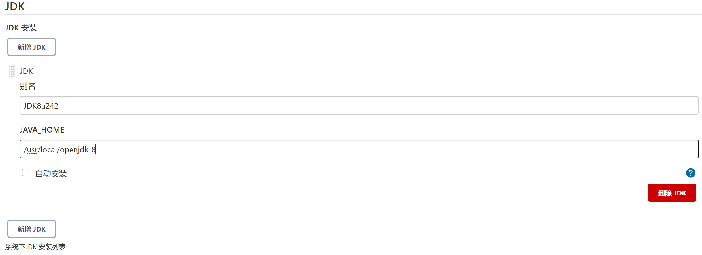
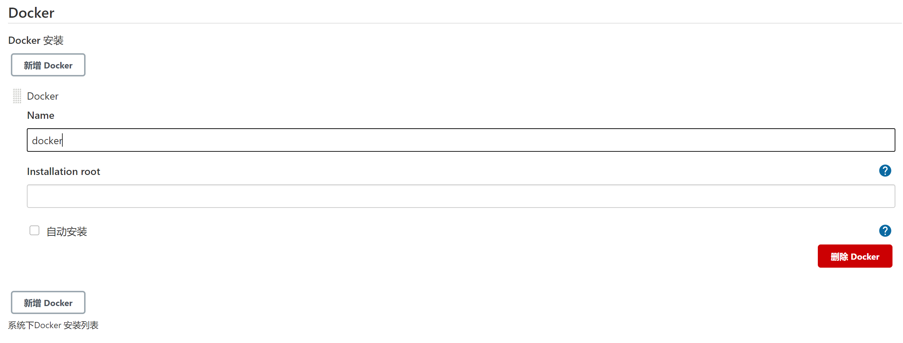
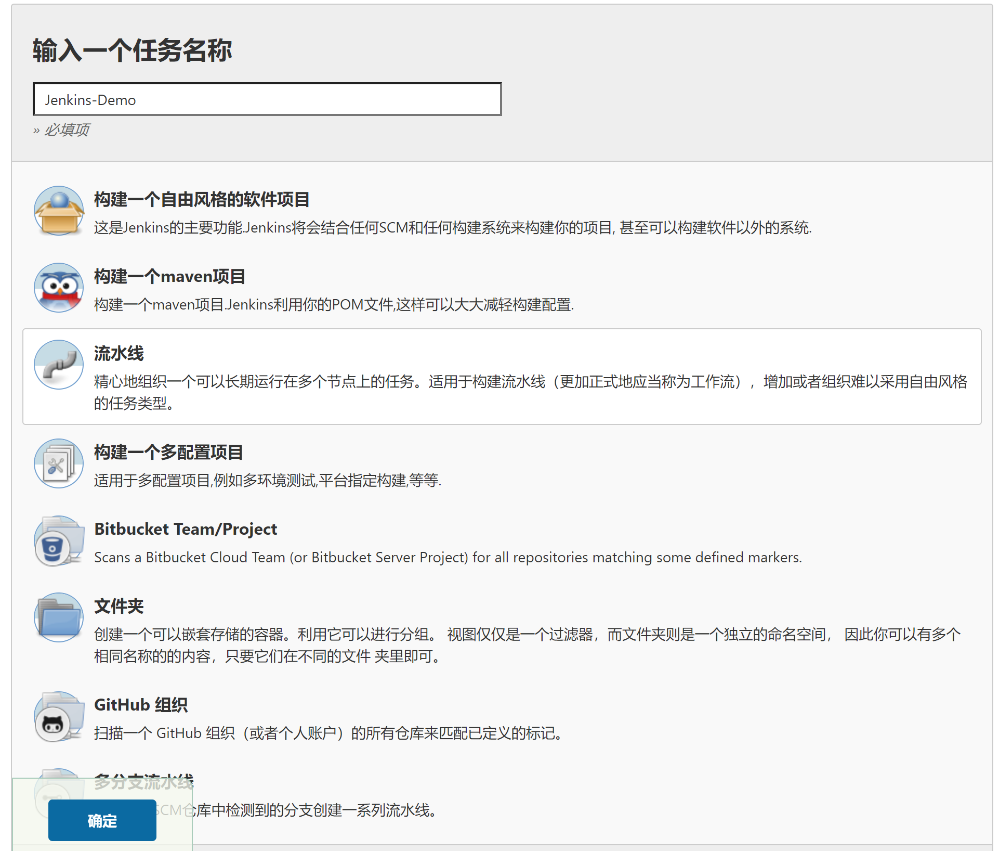
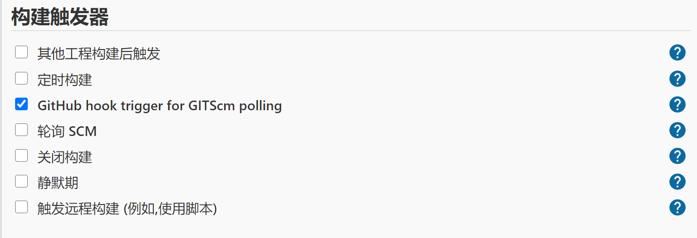
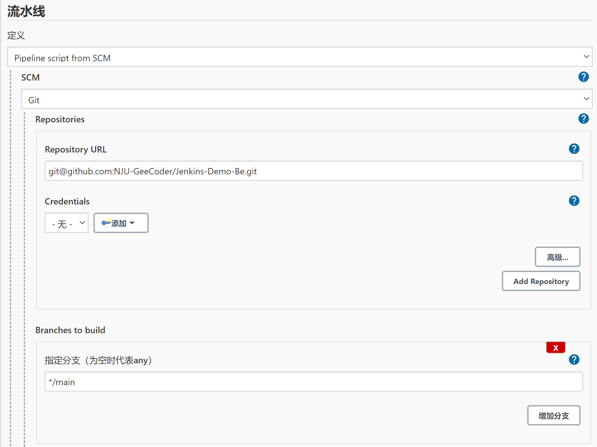
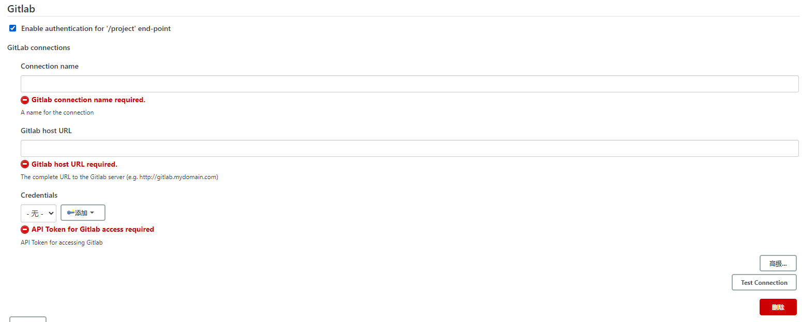

Docker 安装 Jenkins
---
By 张洪胤

> 开始前最好，将docker升级到最新版本(至少大于17)

# 1. 安装过程
1. 首先拉取镜像:`docker pull jenkins`(我安装的是Jenkins 2.275)
2. 创建本地数据卷:`mkdir -p /data/jenkins_home/`
3. 修改用户授权:`chown -R 1000:1000 /data/jenkins_home/`
4. 启动容器:`docker run -d --name jenkins -p 7900:8080 -p 50000:50000 -v /data/jenkins_home:/var/jenkins_home -v /var/run/docker.sock:/var/run/docker.sock jenkins/jenkins`
   1. 这里挂载了物理盘映射
   2. 还挂载了docker映射
5. 访问对应网址:`xxx:7900`
6. 获取初始管理员密码(两种方式，因为映射了本地逻辑卷)
   1. `docker exec jenkins cat /var/jenkins_home/secrets/initialAdminPassword`
   2. 或者在进入容器后(`docker exec -it jenkins /bin/bash`)：`cat /data/jenkins_home/secrets/initialAdminPassword`
7. 选择安装推荐的插件等待即可
8. 按照流程创建管理员账户
9. 根据之前的情况创建实例，即完成

# 2. Jenkins流水线 + Docker + Maven + Github webhooks + Spring boot

## 2.1. 需要的插件和配置

### 2.1.1. 插件
1. Blue Ocean
2. Maven Integration

### 2.1.2. 配置
1. 查看容器的全部信息:`docker inspect jenkins`，其中的Env项中包含了`JAVA_HOME`等环境信息，如下所示

```
"Env": [
      "PATH=/usr/local/openjdk-8/bin:/usr/local/sbin:/usr/local/bin:/usr/sbin:/usr/bin:/sbin:/bin",
      "LANG=C.UTF-8",
      "JAVA_HOME=/usr/local/openjdk-8",
      "JAVA_VERSION=8u242",
      "JAVA_BASE_URL=https://github.com/AdoptOpenJDK/openjdk8-upstream-binaries/releases/download/jdk8u242-b08/OpenJDK8U-jdk_",
      "JAVA_URL_VERSION=8u242b08",
      "JENKINS_HOME=/var/jenkins_home",
      "JENKINS_SLAVE_AGENT_PORT=50000",
      "REF=/usr/share/jenkins/ref",
      "JENKINS_VERSION=2.275",
      "JENKINS_UC=https://updates.jenkins.io",
      "JENKINS_UC_EXPERIMENTAL=https://updates.jenkins.io/experimental",
      "JENKINS_INCREMENTALS_REPO_MIRROR=https://repo.jenkins-ci.org/incrementals",
      "COPY_REFERENCE_FILE_LOG=/var/jenkins_home/copy_reference_file.log"
]
```

2. 进行全局工具配置：`Jenkins -> 系统管理 -> 全局工具管理`
3. jdk配置，如果没有自动安装，如果有则使用上面的JAVA_HOME地址即可



4. Git配置


5. Docker配置



### 2.1.3. 安装maven
1. 同样的进入容器:`docker exec -it -u root jenkins bash`
2. 下载maven压缩包：`wget https://mirrors.aliyun.com/apache/maven/maven-3/3.6.3/binaries/apache-maven-3.6.3-bin.tar.gz`
3. 解压缩maven安装包：`tar -zvxf apache-maven-3.6.3-bin.tar.gz`
4. 配置环境变量：`vi /etc/profile`(安装vi:`apt-get install vi`)

```sh
export MAVEN_HOME=/opt/apache-maven-3.6.3
export MAVEN_HOME
export PATH=$PATH:$MAVEN_HOME/bin
```

1. 编辑maven的`settings.xml`来替换源(位置`conf/`下)，在`<mirrors></mirrors>`标签内添加一下任意一个

```xml
<mirror>
   <id>alimaven</id>
   <name>aliyun maven</name>
   <url>http://maven.aliyun.com/nexus/content/groups/public/</url>
   <mirrorOf>central</mirrorOf>
</mirror>
```

2. 刷新权限:`source /etc/profile`
3. 然后在`Jenkins -> 系统管理 -> 全局工具管理`继续进行Maven配置


### 2.1.4. 配置Jenkins使用Docker
1. 之前在创建容器的时候已经完成了sock的映射
2. 登录进入jenkins容器:`docker exec -it -u root jenkins bash`
3. 安装docker client:

```sh
apt-get update && \
apt-get -y install apt-transport-https \
     ca-certificates \
     curl \
     gnupg2 \
     software-properties-common && \
curl -fsSL https://download.docker.com/linux/$(. /etc/os-release; echo "$ID")/gpg > /tmp/dkey; apt-key add /tmp/dkey && \
add-apt-repository \
   "deb [arch=amd64] https://download.docker.com/linux/$(. /etc/os-release; echo "$ID") \
   $(lsb_release -cs) \
   stable" && \
apt-get update && \
apt-get -y install docker-ce
```

4. 通过输入`docker`来检查是否成功
5. 授予jenkins用户docker权限：
   1. 以root用户身份进入jenkins容器：`docker exec -it -u root jenkins /bin/bash`
   2. 查看当前用户情况:`ls -l /var/run/docker.sock`
   3. 授权`jenkins`用户:`chown jenkins: /var/run/docker.sock`
   4. 再次查看用户情况:`ls -l /var/run/docker.sock`
   5. 检查`docker ps`之类的命令是否可以使用

### 2.1.5. 配置Jenkins中的Git SSH
1. 进入jenkins容器:`docker exec -it jenkins /bin/bash`
2. 生成SSH密钥:`ssh-keygen`，一路回车使用默认值
3. 查找密钥：`cat /var/jenkins_home/.ssh/id_rsa.pub`
4. 然后登录Github，在`settings->SSH and GPG keys`中添加密钥。

### 2.1.6. Github添加Webhook
1. 进入想要部署的仓库，`settings -> webhook`，选择`Add Webhook`
2. 设置payload_url为jenkins对应地址:`xxx(jenkins访问网址)/github-webhook/`
3. 选择`Just the push event.`和`Active`后保存即可

### 2.1.7. 配置主从节点
> 避免出现如下报错：pending—Waiting for next available executor

1. 进入对应位置:`系统管理 -> 节点管理`
2. 点击`配置主从节点`，设置至少为2个。


## 2.2. 使用流水线新建任务
1. 点击`新建任务`，新建一个名为`Jenkins-Demo`的流水线任务



2. `构建触发器`选择`GitHub hook trigger for GITScm polling`



3. 流水线中(`jenkinsfile`文件放置在仓库根目录下)
   1. `定义`选择`Pipeline script from SCM`
   2. `SCM`选择`Git`
   3. `Repository URL`输入对应仓库的`git@xxx.git`地址
4. 如果出现报错如下，则先进入jenkins容器输入命令`git ls-remote -h -- git@github.com:xxx.git HEAD`：并输入`yes`确认

```
无法连接仓库：Command "git ls-remote -h -- git@github.com:xxx.git HEAD" returned status code 128:
stdout:
stderr: Host key verification failed.
fatal: Could not read from remote repository.

Please make sure you have the correct access rights
and the repository exists
```

5. 最后指定分支为`main`，整体如下图所示



6. 之后选择保存即可
7. 之后点击`立即构建`来查看效果

# 3. GitLab + Jenkins + Spring Boot

## 3.1. 配置GitLab插件和连接
1. Jenkins需要安装插件GitLab Plugin和GitLab Hook Plugin
2. 进入系统配置，找到GitLab的配置位置，进行配置



3. 注意上面需要的API token需要到GitLab的用户设置中，生成Personal Access Tokens
4. 填写完成后点击Test Connection，如果显示Success表示配置成功
5. 完成GitLab的Ssh配置，过程完全类似第二大步中的对应步骤。

## 3.2. 创建项目
1. 勾选Build when a change is pushed to GitLab. GitLab webhook URL:
2. 下拉找到点击高级，找到Allowed branches，选择Filter branch by name(一般是master)
3. 在下拉，来到流水线中，选择Pipeline script from SCM，URL填写GitLab获取的URL，进行测试(注意如果出现`git ls-remote -h -- ssh://git@xxx.git HEAD`，第一次是需要进入容器执行该命令，并输入yes)
4. 进入GitLab的对应项目仓库，找到settings->integration配置刚刚得到的webhook URL，然后点击Test(模拟一次Push events)，如果返回为403码，则查看参考八
5. 之后配置好jenkinsfile，然后跟踪构建结果即可。

# 4. 实用插件
1. <a href = "https://blog.csdn.net/github_39160845/article/details/108960606">Jenkins 嵌入到 Iframe</a>
2. <a href = "https://www.cnblogs.com/kevingrace/p/6019707.html">Jenkins用户组管理</a>

# 5. 配置Jenkins的分布式构建和部署
1. <a href = "https://blog.csdn.net/achenyuan/article/details/86644954">jenkins分布式构建和部署(master-slave)</a>

# 6. 参考
1. <a href = "https://www.jenkins.io/zh/doc/book/installing/">Jenkins官方教程</a>
2. <a href = "https://segon.cn/install-jenkins-using-docker.html">Docker 安装 Jenkins （超详细）</a>
3. <a href = "https://www.cnblogs.com/ningy1009/p/12665716.html">Jenkins 插件安装失败解决办法</a>
4. <a href = "https://blog.csdn.net/linfen1520/article/details/109045063">Jenkins+Docker+github+Spring Boot自动化部署</a>
5. <a href = "https://www.jianshu.com/p/c570e0bb4926">Jenkins容器中安装Docker</a>
6. <a href = "https://blog.csdn.net/zhichuan0307/article/details/108273161">Jenkins持续集成显示pending—Waiting for next available executor</a>
7. <a href = "https://jenkins-zh.cn/wechat/articles/2019/06/2019-06-14-setup-jenkins-ci-in-30-minutes/">30分钟搞定 Jenkins CI</a>
8. <a href = "https://www.cnblogs.com/kaerxifa/p/11671961.html">gitlab webhook jenkins 403问题解决方案</a>