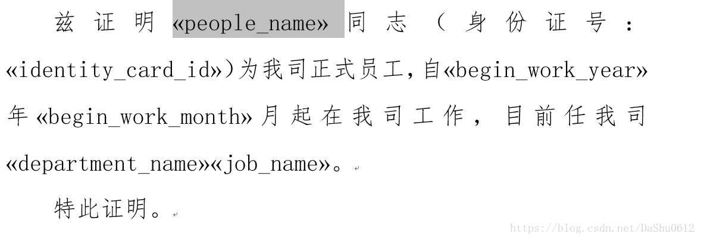

docx-mailmerge
---
<!-- TOC -->

- [1. 什么是docx-mailmerge](#1-什么是docx-mailmerge)
- [2. 使用Word模板](#2-使用word模板)
- [3. 具体python部分的设置](#3-具体python部分的设置)
- [4. 完整源码](#4-完整源码)
- [5. 参考](#5-参考)

<!-- /TOC -->

# 1. 什么是docx-mailmerge
1. 我们在项目开发中，会有一些生成Word文件的操作，比如获取到一些数据添加到Word。

# 2. 使用Word模板
1. 在你需要插入数据的地方，我们选择"插入"->文档部件->域。
2. 在中间选择邮件合并，域名选择MergeField，域名可以理解为你在代码中的一个变量，将你要插入的数据赋值给一个变量，然后将你插入的数据赋值给这个变量，你的数据就会按照你设置好的地方插入到模板中，另外格式可以单独设置，若无则为默认格式。
结果如下。


# 3. 具体python部分的设置
1. 以下的例子里面文件名称和域的名称是固定的。
2. 写入语句:`document_1.write('F:\\{}.docx'.format(emp_full_info.get("identity_card")))`
3. 编码问题的解决:`Year=year.decode(encoding='UTF-8', errors='strict')`

# 4. 完整源码
```py
from mailmerge import MailMerge  # 打印模板
template = "F:\\WorkingProve11.docx"      # 创建邮件合并文档并查看所有字段
document_1 = MailMerge(template)
print("Fields included in {}: {}".format(template,document.get_merge_fields()))
document_1.merge(
    people_name=u'勒布朗',
    identity_card_id='123456789',
    begin_work_year='2018',
    begin_work_month='7',
    department_name=u'洛杉矶湖人',
    job_name=u'联盟第一人'
)
document_1.write('F:\\test666.docx')
```

# 5. 参考
1. <a href = "https://blog.csdn.net/DaShu0612/article/details/82912064">python和word模板</a>