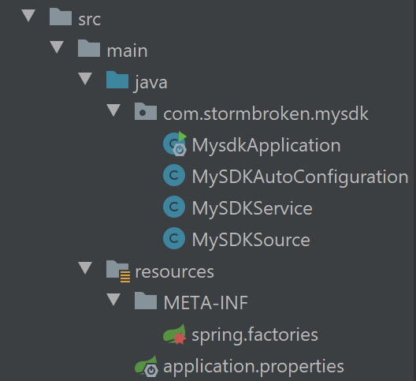
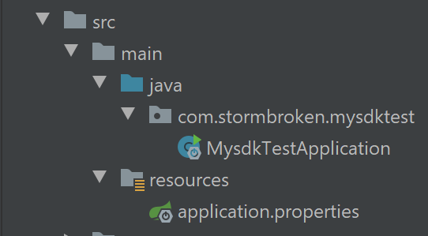
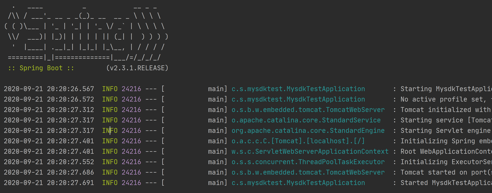

Spring MySDK
---
1. 将自己写好的部分封装，作为SDK给其他部分使用
2. Spring 版本均为2.3.1

<!-- TOC -->

- [1. mysdk 项目](#1-mysdk-项目)
  - [1.1. 创建项目](#11-创建项目)
  - [1.2. 创建MySDKSource类](#12-创建mysdksource类)
  - [1.3. 创建MySDKService类](#13-创建mysdkservice类)
  - [1.4. 创建MySDKAutoConfiguration类](#14-创建mysdkautoconfiguration类)
  - [1.5. 打包](#15-打包)
- [2. 创建mysdk-test项目](#2-创建mysdk-test项目)
  - [2.1. 修改pom文件，添加刚刚打包好的项目](#21-修改pom文件添加刚刚打包好的项目)
  - [2.2. 修改MysdkTestApplication文件](#22-修改mysdktestapplication文件)
  - [2.3. 测试运行](#23-测试运行)
    - [2.3.1. 报错：找不到Bean](#231-报错找不到bean)
    - [2.3.2. 报错:没有成功自动装配](#232-报错没有成功自动装配)
    - [2.3.3. 成功运行效果](#233-成功运行效果)

<!-- /TOC -->

# 1. mysdk 项目
1. MysdkApplication没有修改
2. 目录结构



## 1.1. 创建项目
1. 创建一个新项目，使用官方默认提供的初始化器，注意勾选spring web选项
2. 注释掉pom文件中的如下代码:可能会导致打包出现问题，我们打包选择maven clear + install 的方式
```xml
<build>
    <plugins>
        <plugin>
            <groupId>org.springframework.boot</groupId>
            <artifactId>spring-boot-maven-plugin</artifactId>
        </plugin>
    </plugins>
</build>
```

## 1.2. 创建MySDKSource类
1. 这个类是数据的模板，开启自动配置

```java
package com.stormbroken.mysdk;

import org.springframework.boot.context.properties.ConfigurationProperties;

/**
 * @Author stormbroken
 * Create by 2020/09/21
 * @Version 1.0
 **/

// 这个时候会报错，不要慌，是因为没有写一个对应的EnableConfigurationProperties注解
@ConfigurationProperties(prefix = "mysdk")
public class MySDKSource {
    private String type;

    private String rate;

    public String getType() {
        return type;
    }

    public String getRate() {
        return rate;
    }

    public void setType(String type) {
        this.type = type;
    }

    public void setRate(String rate) {
        this.rate = rate;
    }
}
```

## 1.3. 创建MySDKService类
1. 这个类定义了这个Spring Boot对外提供的两个服务

```java
package com.stormbroken.mysdk;

/**
 * @Author stormbroken
 * Create by 2020/09/21
 * @Version 1.0
 **/

public class MySDKService {
    private MySDKSource mySDKSource;

    public MySDKService(MySDKSource mySDKSource){
        this.mySDKSource = mySDKSource;
    }

    public String getType(){
        return mySDKSource.getType();
    }

    public String getRate(){
        return mySDKSource.getRate();
    }
}
```

## 1.4. 创建MySDKAutoConfiguration类
1. 还记得刚刚那个报错吗？我们现在来解决这个报错。

```java
package com.stormbroken.mysdk;

import org.springframework.beans.factory.annotation.Autowired;
import org.springframework.boot.autoconfigure.condition.ConditionalOnMissingBean;
import org.springframework.boot.autoconfigure.condition.ConditionalOnProperty;
import org.springframework.boot.context.properties.EnableConfigurationProperties;
import org.springframework.context.annotation.Bean;
import org.springframework.context.annotation.Configuration;

/**
 * @Author stormbroken
 * Create by 2020/09/21
 * @Version 1.0
 **/
//正常的配置注解
@Configuration
//和ConfigurationProperties对应
@EnableConfigurationProperties(MySDKSource.class)
//条件装配 Conditionalxxx，mysdk.enable的值是enable的时候才装配，如果不是enable则不会装配
@ConditionalOnProperty(name = "mysdk.enable", havingValue = "enable")
public class MySDKAutoConfiguration {
    @Autowired
    private MySDKSource mySDKSource;

    @Bean
    @ConditionalOnMissingBean(MySDKSource.class)
    public MySDKService mySDKService(){
        return new MySDKService(mySDKSource);
    }
}
```

## 1.5. 打包
1. 使用maven clean + install

# 2. 创建mysdk-test项目
1. 这个项目用来测试刚刚的封装是否成功。
2. 项目结构



## 2.1. 修改pom文件，添加刚刚打包好的项目
1. 在pom文件中添加
```xml
<!-- 从另一个项目的最上面的配置将对应的部分拷贝过来，然后就可以被拉取到 -->
<dependency>
  <groupId>com.stormbroken</groupId>
  <artifactId>mysdk</artifactId>
  <version>0.0.1-SNAPSHOT</version>
</dependency>
```

## 2.2. 修改MysdkTestApplication文件
```java
package com.stormbroken.mysdktest;

import com.stormbroken.mysdk.MySDKService;
import org.springframework.beans.factory.annotation.Autowired;
import org.springframework.boot.SpringApplication;
import org.springframework.boot.autoconfigure.SpringBootApplication;
import org.springframework.web.bind.annotation.GetMapping;
import org.springframework.web.bind.annotation.RestController;

@SpringBootApplication
@RestController
public class MysdkTestApplication {

    public static void main(String[] args) {
        SpringApplication.run(MysdkTestApplication.class, args);
    }

    // 注入另一个包中的服务
    @Autowired
    MySDKService mySDKService;
    
    @GetMapping("/mysdk")
    public String getMySDK(){
        return mySDKService.getType() + ":" + mySDKService.getRate();
    }
}
```

## 2.3. 测试运行
1. 启动MysdkTestApplication

### 2.3.1. 报错：找不到Bean
```
***************************
APPLICATION FAILED TO START
***************************

Description:

Field mySDKService in com.stormbroken.mysdktest.MysdkTestApplication required a bean of type 'com.stormbroken.mysdk.MySDKService' that could not be found.

The injection point has the following annotations:
	- @org.springframework.beans.factory.annotation.Autowired(required=true)


Action:

Consider defining a bean of type 'com.stormbroken.mysdk.MySDKService' in your configuration.
```

1. 没有进行工厂配置，找不到对应的部分
2. 解决方案:在mysdk项目中新建`resources/META-INF/spring.factories`，内容为:
```
# 必须要进行工厂的配置，不然无法找到
org.springframework.boot.autoconfigure.EnableAutoConfiguration=com.stormbroken.mysdk.MySDKAutoConfiguration
```

3. 重新maven clean + install套餐

### 2.3.2. 报错:没有成功自动装配
```
***************************
APPLICATION FAILED TO START
***************************

Description:

Field mySDKService in com.stormbroken.mysdktest.MysdkTestApplication required a bean of type 'com.stormbroken.mysdk.MySDKService' that could not be found.

The injection point has the following annotations:
	- @org.springframework.beans.factory.annotation.Autowired(required=true)

The following candidates were found but could not be injected:
	- Bean method 'mySDKService' in 'MySDKAutoConfiguration' not loaded because @ConditionalOnProperty (mysdk.enable=enable) did not find property 'mysdk.enable'


Action:

Consider revisiting the entries above or defining a bean of type 'com.stormbroken.mysdk.MySDKService' in your configuration.

```

1. 问题:忘了开启自动配置，并添加信息
2. 在mysdk-test的`application.properties`中添加配置信息如下

```properties
mysdk.enable=enable
mysdk.type=下雨
mysdk.rate=0.01
```

### 2.3.3. 成功运行效果


1. 在浏览器输入:`http://localhost:8080/mysdk`
2. 可以得到如下结果


