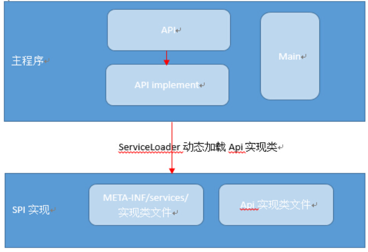

Spring Service层
---

<!-- TOC -->

- [1. Service层](#1-service层)
- [2. Java SPI 机制浅析与简单示例](#2-java-spi-机制浅析与简单示例)
  - [2.1. SPI机制](#21-spi机制)
  - [2.2. SPI机制的约定](#22-spi机制的约定)
  - [2.3. 代码理解SPI机制](#23-代码理解spi机制)
- [3. 参考](#3-参考)

<!-- /TOC -->

# 1. Service层
```java
@Service
public class StoryServiceImpl implements StoryService {
    @Autowired
    private StoryDao storyDao;
    @Override
    public void save();//需要重载
}
```
1. @Service对应业务层的Bean。
2. @Service注解是告诉Spring，Spring容器中会存在StoryServiceImpl的bean，当Controller需要使用StoryServiceImpl的的实例时，就可以将Spring创建好的bean注入。在Controller只需要声明一个变量storyService来接收，不用通过new StoryServiceImpl()实例化。接收方式如下
```java
@RestController
@RequestMapping("/story")
public class StoryController {
    @Autowired
    private StoryService storyService;
}
```
3. @Autowired作用是自动装配bean，而无需再为field设置getter,setter方法。

# 2. Java SPI 机制浅析与简单示例

## 2.1. SPI机制
1. SPI:Service Provider Interface(Service提供者接口)
2. 总体上来说，提供给厂商与扩展框架功能的开发者使用的接口
3. 这样子就可以保证我们不修改jar包的情况下修改实现。

## 2.2. SPI机制的约定



1. 在META-INF/services/目录中创建以接口全限定名命名的文件该文件内容为Api具体实现类的全限定名
2. 使用ServiceLoader类动态加载META-INF中的实现类
3. 如SPI的实现类为Jar则需要放在主程序classPath中
4. Api具体实现类必须有一个不带参数的构造方法

## 2.3. 代码理解SPI机制
1. IOperation接口
```java
public interface IOperation {
	public int operation(int numberA, int numberB);
}
```
2. PlusOperationImpl
```java
public class PlusOperationImpl implements IOperation {
    public int operation(int numberA, int numberB) {
        return numberA + numberB;
    }
}
```
3. DivisionOperationImpl
```java
public class DivisionOperationImpl implements IOperation{
    public int operation(int numberA, int numberB) {
        return numberA / numberB;
    }
}
```

# 3. 参考
1. <a href = "https://blog.csdn.net/zmx729618/article/details/53285416">Java的SPI机制浅析与简单示例</a>