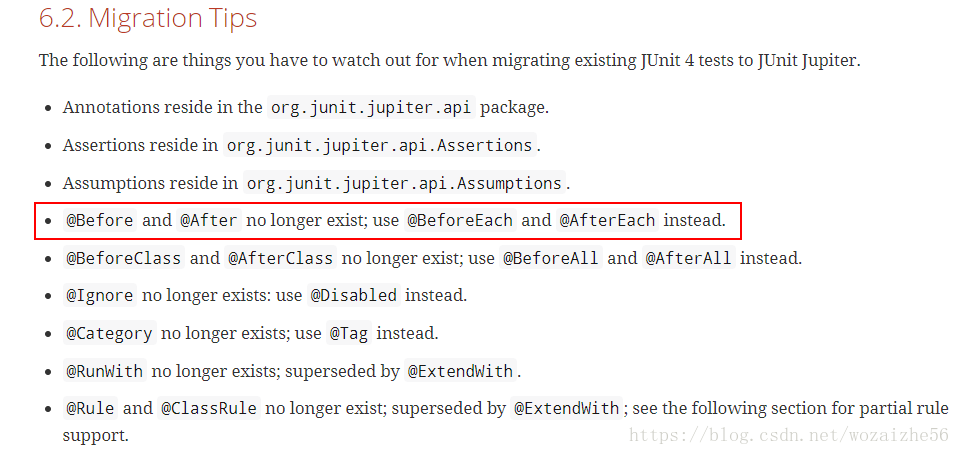

Spring Junit
---
1. 随着Spring开发的深入，我们逐渐打算使用Spring-test与Junit结合进行开发测试

<!-- TOC -->

- [1. Jar形式的Maven依赖](#1-jar形式的maven依赖)
- [2. 用来加载的Spring的上下文环境](#2-用来加载的spring的上下文环境)
- [3. 正常的测试类的形式和实现](#3-正常的测试类的形式和实现)
  - [3.1. 非Controller部分的测试检测](#31-非controller部分的测试检测)
  - [3.2. Controller部分的测试](#32-controller部分的测试)
- [4. Junit中出现的问题汇总](#4-junit中出现的问题汇总)
  - [4.1. @Before 和 @After 注解部分不执行](#41-before-和-after-注解部分不执行)
  - [4.2. 总结对比@Before，@BeforeClass，@BeforeEach，@BeforeAll](#42-总结对比beforebeforeclassbeforeeachbeforeall)
- [5. 参考](#5-参考)

<!-- /TOC -->

# 1. Jar形式的Maven依赖
```xml
<dependency>
    <groupId>junit</groupId>
    <artifactId>junit</artifactId>
    <version>3.8.1</version>
    <scope>test</scope>
</dependency>
<dependency>
    <groupId>org.springframework</groupId>
    <artifactId>spring-test</artifactId>
    <version>4.0.6.RELEASE</version>
</dependency>
```

# 2. 用来加载的Spring的上下文环境
```java

@SpringBootTest(webEnvironment = SpringBootTest.WebEnvironment.RANDOM_PORT)
public class BaseTest {
    //如此用来加载环境
    protected MockMvc mockMvc;
    @Autowired
    protected WebApplicationContext wac;
    @Before()  //这个方法在每个方法执行之前都会执行一遍
    public void setup() {
        mockMvc = MockMvcBuilders.webAppContextSetup(wac).build();  //初始化MockMvc对象
    }
}
```

# 3. 正常的测试类的形式和实现
1. 继承自BaseTest，然后进行正常的测试

## 3.1. 非Controller部分的测试检测
1. 直接使用@AutoWired来自动装载对应测试部分

## 3.2. Controller部分的测试
1. 我们使用MockMvc来完成
2. 加载参数可以
   1. 通过JSON格式转换(使用.content(string))方法完成
   2. 通过param来一个一个处理。

```java
@RunWith(SpringJUnit4ClassRunner.class)  
@WebAppConfiguration  
@ContextConfiguration({"classpath*:/beans.xml","classpath*:/spring-mvc.xml"}) 
//当然 你可以声明一个事务管理 每个单元测试都进行事务回滚 无论成功与否  
@TransactionConfiguration(defaultRollback = true)  
@Transactional 
public class TestController extends BaseTest{
    @Test  
    public void testLogin() throws Exception {  
        mockMvc.perform((post("/loginTest").param("userName", "admin").param("password", "1"))).andExpect(status().isOk()).andDo(print());
        //进行处理之后的检测
    }
}
```

# 4. Junit中出现的问题汇总

## 4.1. @Before 和 @After 注解部分不执行
```java
//问题代码
@Before
public void init() {
	System.out.println("init");
}
@After
public void destroy(){
	System.err.println("destroy");
}
@Test
public void test() {
	System.out.println("test");
} 
```


1. 在正常执行的时候，并没有执行@Before和@After的代码
2. 在Junit5 中已经不存在@Before和@After注释的方法，对应的方法为 @BeforeEach 和 @AfterEach。

## 4.2. 总结对比@Before，@BeforeClass，@BeforeEach，@BeforeAll

| 特性                                                                                                            | Junit4       | Junit5      |
| --------------------------------------------------------------------------------------------------------------- | ------------ | ----------- |
| 1. 在当前类的所有测试方法之前执行。<br>2. 注解在静态方法上。<br> 3. 此方法可以包含一些初始化代码。              | @BeforeClass | @BeforeAll  |
| 1. 在当前类中的所有测试方法之后执行。<br> 2. 注解在静态方法上。<br> 3. 此方法可以包含一些清理代码。             | @AfterClass  | @AfterAll   |
| 1. 在每个测试方法之前执行。<br> 2. 注解在非静态方法上。<br>3. 可以重新初始化测试方法所需要使用的类的某些属性。 | @Before      | @BeforeEach |
| 1. 在每个测试方法之后执行。<br> 2. 注解在非静态方法上。<br> 3. 可以回滚测试方法引起的数据库修改。     | @After       | @AfterEach  |


# 5. 参考
1. <a href = "https://blog.csdn.net/wozaizhe56/article/details/80440452">JUnit5 @Before @After 注解部分不执行</a>
2. <a href = "https://blog.csdn.net/iexploration/article/details/82023893">@Before, @BeforeClass, @BeforeEach 和 @BeforeAll之间的不同</a>