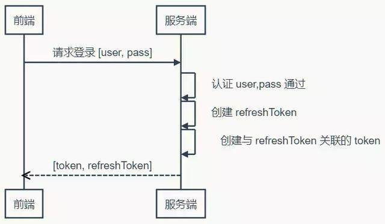
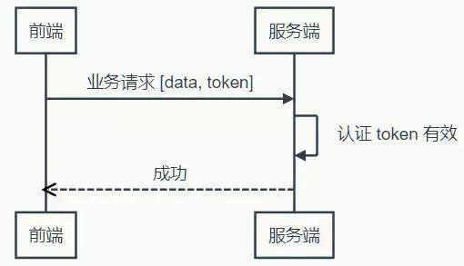
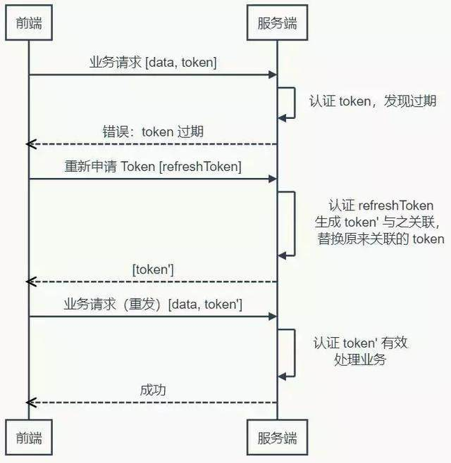
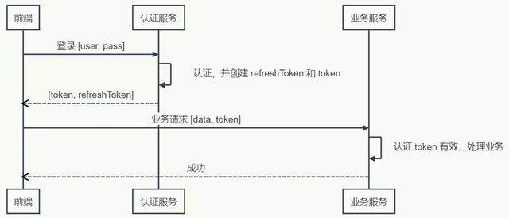
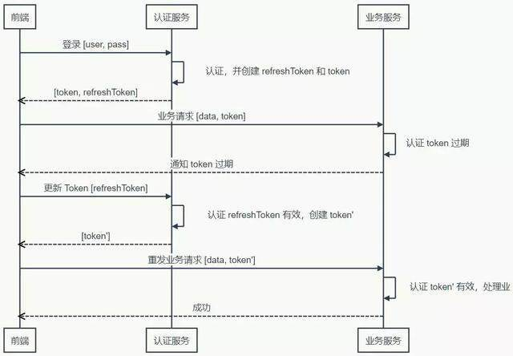

深入理解Token
---
1. Token是在服务端产生的，如果前端使用用户名/密码向服务端请求认证，服务端认证成功，那么在服务端会返回Token给前端。前端可以在每次请求的时候带上Token证明自己的合法地位。

<!-- TOC -->

- [1. 为什么要使用Token?](#1-为什么要使用token)
- [2. Token的时效性讨论](#2-token的时效性讨论)
  - [2.1. 解决方案一](#21-解决方案一)
  - [2.2. 解决方案二](#22-解决方案二)
  - [2.3. 时序图表示法](#23-时序图表示法)
- [3. 什么是无状态Token](#3-什么是无状态token)
  - [3.1. 对称加密算法](#31-对称加密算法)
  - [3.2. 前端不同情况的不同操作](#32-前端不同情况的不同操作)
  - [3.3. 注意点](#33-注意点)
  - [3.4. 分离认证服务](#34-分离认证服务)
  - [3.5. 不受信的业务服务器](#35-不受信的业务服务器)
- [4. 参考](#4-参考)

<!-- /TOC -->

# 1. 为什么要使用Token?
1. Token完全由应用管理，所以可以避开同源策略。
2. Token可以避免CSRF攻击
3. Token可以是无状态的，可以在多个服务间共享(也就是前端请求的时候带上Token来证明自己的合法身份)

# 2. Token的时效性讨论
1. 根本问题:如何让用户在操作过程中感觉不到token失效的问题

## 2.1. 解决方案一
1. 服务器端保存Token状态，每一次操作都会刷新token的过期时间(Session的实现策略)
   1. 问题:前后端分离的部分会导致请求量过大
   2. 如果持久化:更大的代价
2. 我们为了提升效率会将Token的过期时间保存在环境或者内存中。

## 2.2. 解决方案二
1. 使用Refresh Token的策略，避免频繁的读写
2. 一旦Token过期，前端使用一个Refresh Token申请一个新的Token，我们只需要对于新的Token进行有效性检查即可

## 2.3. 时序图表示法

# 3. 什么是无状态Token
1. 如果我们把所有状态信息都附加在Token上，服务器就可以不保存。
2. 签名有效性的检验:
   1. 一方签发，另一方检验:使用非对称加密算法
   2. 一方签发，一方检验:(同一方):使用对称加密算法
   3. 对称加密算法要远远快于非对称加密算法

## 3.1. 对称加密算法
1. 加密
2. 还原加密内容
3. 不需要解密，摘要(散列算法会很快)么指定密码的散列算法，HMAC

## 3.2. 前端不同情况的不同操作
1. 在前端可控的情况下(比如前端和服务端在同一个项目组内)，可以协商：前端一但注销成功，就丢掉本地保存(比如保存在内存、LocalStorage 等)的 Token 和 Refresh Token。基于这样的约定，服务器就可以假设收到的 Token 一定是没注销的(因为注销之后前端就不会再使用了)。
2. 如果前端不可控的情况，仍然可以进行上面的假设，但是这种情况下，需要尽量缩短 Token 的有效期，而且必须在用户主动注销的情况下让 Refresh Token 无效。这个操作存在一定的安全漏洞，因为用户会认为已经注销了，实际上在较短的一段时间内并没有注销。如果应用设计中，这点漏洞并不会造成什么损失，那采用这种策略就是可行的。

## 3.3. 注意点
1. Refresh Token 有效时间较长，所以它应该在服务器端有状态，以增强安全性，确保用户注销时可控
2. 应该考虑使用二次认证来增强敏感操作的安全性

## 3.4. 分离认证服务
1. 当 Token 无状态之后，单点登录就变得容易了。前端拿到一个有效的 Token，它就可以在任何同一体系的服务上认证通过——只要它们使用同样的密钥和算法来认证 Token 的有效性。

2. 可见，虽然认证和业务分离了，实际即并没产生多大的差异。当然，这是建立在认证服务器信任业务服务器的前提下，因为认证服务器产生 Token 的密钥和业务服务器认证 Token 的密钥和算法相同。换句话说，业务服务器同样可以创建有效的 Token。

## 3.5. 不受信的业务服务器
1. 遇到不受信的业务服务器时，很容易想到的办法是使用不同的密钥。认证服务器使用密钥1签发，业务服务器使用密钥2验证——这是典型非对称加密签名的应用场景。
2. 认证服务器自己使用私钥对 Token 签名，公开公钥。信任这个认证服务器的业务服务器保存公钥，用于验证签名。幸好，JWT 不仅可以使用 HMAC 签名，也可以使用 RSA(一种非对称加密算法)签名。
3. 不过，当业务服务器已经不受信任的时候，多个业务服务器之间使用相同的 Token 对用户来说是不安全的。因为任何一个服务器拿到 Token 都可以仿冒用户去另一个服务器处理业务……悲剧随时可能发生。
4. 为了防止这种情况发生，就需要在认证服务器产生 Token 的时候，把使用该 Token 的业务服务器的信息记录在 Token 中，这样当另一个业务服务器拿到这个 Token 的时候，发现它并不是自己应该验证的 Token，就可以直接拒绝。
5. 现在，认证服务器不信任业务服务器，业务服务器相互也不信任，但前端是信任这些服务器的——如果前端不信任，就不会拿 Token 去请求验证。那么为什么会信任？可能是因为这些是同一家公司或者同一个项目中提供的若干服务构成的服务体系。
6. 但是，前端信任不代表用户信任。如果 Token 不没有携带用户隐私(比如姓名)，那么用户不会关心信任问题。但如果 Token 含有用户隐私的时候，用户得关心信任问题了。这时候认证服务就不得不再啰嗦一些，当用户请求 Token 的时候，问上一句，你真的要授权给某某某业务服务吗？而这个"某某某"，用户怎么知道它是不是真的"某某某"呢？用户当然不知道，甚至认证服务也不知道，因为公钥已经公开了，任何一个业务都可以声明自己是"某某某"。
7. 为了得到用户的信任，认证服务就不得不帮助用户来甄别业务服务。所以，认证服器决定不公开公钥，而是要求业务服务先申请注册并通过审核。只有通过审核的业务服务器才能得到认证服务为它创建的，仅供它使用的公钥。如果该业务服务泄漏公钥带来风险，由该业务服务自行承担。现在认证服务可以清楚的告诉用户，"某某某"服务是什么了。如果用户还是不够信任，认证服务甚至可以问，某某某业务服务需要请求  A、B、C 三项个人数据，其中 A 是必须的，不然它不工作，是否允许授权？如果你授权，我就把你授权的几项数据加密放在 Token 中……
8. 废话了这么多，有没有似曾相识……对了，这类似开放式 API 的认证过程。开发式 API 多采用 OAuth 认证，而关于 OAuth 的探讨资源非常丰富，这里就不深究了。

# 4. 参考
1. <a href = "https://www.cnblogs.com/xuxinstyle/p/9675541.html">深入理解token</a>