第一个微服务项目
---
1. 以下部分，均将Spring版本调整为2.1.3,Spring-Cloud版本调整为Hoxton.RS6

# 1. 目标任务
1. 使用Spring Boot开发两个微服务:(Admin Service 和 User Service)
2. 两个微服务都注册到Eureka
3. Admin Service提供一个新增用户的API，对API的用户名和密码要做不为空的处理，然后通过服务发现User Service 完成增加用户的操作
4. User Service 也提供了增加用户的API;完成对数据库中用户表的操作

# 2. eureka-server
1. 项目目录


## 2.1. 创建项目
| 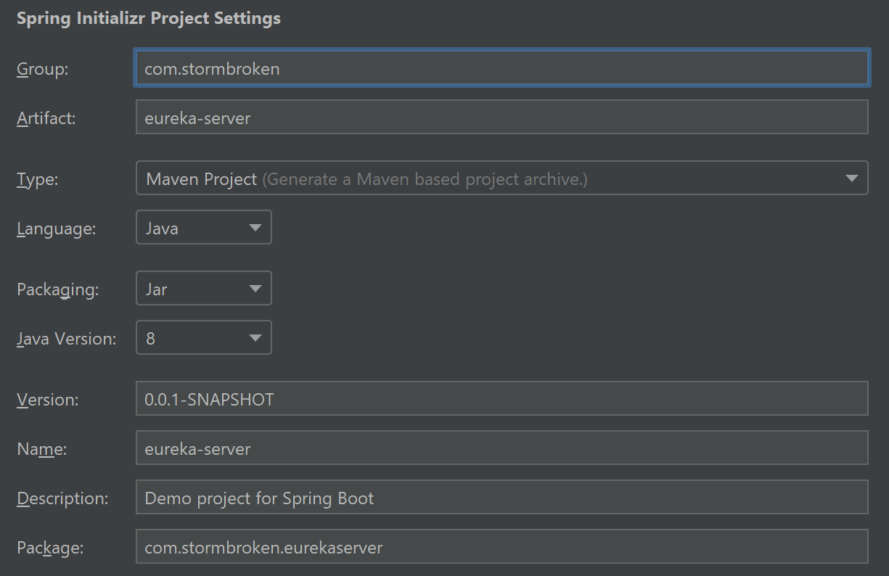 | 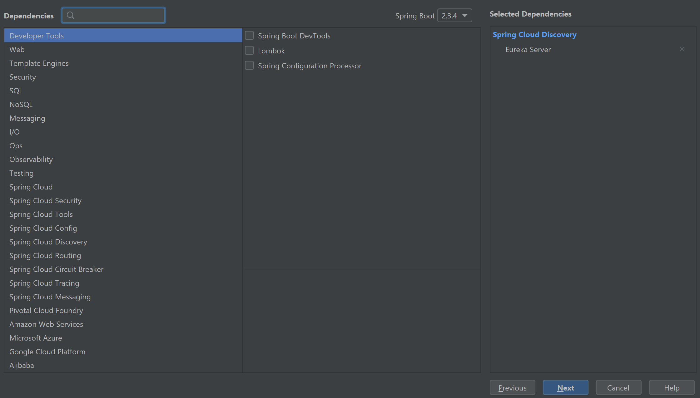 |
| -------------------- | -------------------- |

## 2.2. pom文件

```xml
<?xml version="1.0" encoding="UTF-8"?>
<project xmlns="http://maven.apache.org/POM/4.0.0" xmlns:xsi="http://www.w3.org/2001/XMLSchema-instance"
         xsi:schemaLocation="http://maven.apache.org/POM/4.0.0 https://maven.apache.org/xsd/maven-4.0.0.xsd">
    <modelVersion>4.0.0</modelVersion>
    <parent>
        <groupId>org.springframework.boot</groupId>
        <artifactId>spring-boot-starter-parent</artifactId>
        <version>2.3.1.RELEASE</version>
        <relativePath/> <!-- lookup parent from repository -->
    </parent>
    <groupId>com.stormbroken</groupId>
    <artifactId>eureka-server</artifactId>
    <version>0.0.1-SNAPSHOT</version>
    <name>eureka-server</name>
    <description>Demo project for Spring Boot</description>

    <properties>
        <java.version>1.8</java.version>
        <spring-cloud.version>Hoxton.SR6</spring-cloud.version>
    </properties>

    <dependencies>
        <!-- Eureka 的配置 -->
        <dependency>
            <groupId>org.springframework.cloud</groupId>
            <artifactId>spring-cloud-starter-netflix-eureka-server</artifactId>
        </dependency>

        		<dependency>
        			<groupId>org.springframework.boot</groupId>
        			<artifactId>spring-boot-starter-test</artifactId>
        			<scope>test</scope>
        			<exclusions>
        				<exclusion>
        					<groupId>org.junit.vintage</groupId>
        					<artifactId>junit-vintage-engine</artifactId>
        				</exclusion>
        			</exclusions>
        		</dependency>
    </dependencies>

    <dependencyManagement>
        <dependencies>
            <dependency>
                <groupId>org.springframework.cloud</groupId>
                <artifactId>spring-cloud-dependencies</artifactId>
                <version>${spring-cloud.version}</version>
                <type>pom</type>
                <scope>import</scope>
            </dependency>
        </dependencies>
    </dependencyManagement>

    <build>
        <plugins>
            <plugin>
                <groupId>org.springframework.boot</groupId>
                <artifactId>spring-boot-maven-plugin</artifactId>
            </plugin>
        </plugins>
    </build>

</project>

```

## 2.3. 修改EurekaServerApplication注册为服务器
```java
package com.stormbroken.eurekaserver;

import org.springframework.boot.SpringApplication;
import org.springframework.boot.autoconfigure.SpringBootApplication;
import org.springframework.cloud.netflix.eureka.server.EnableEurekaServer;

@SpringBootApplication
// Eureka的服务端配置
@EnableEurekaServer
public class EurekaServerApplication {

    public static void main(String[] args) {
        SpringApplication.run(EurekaServerApplication.class, args);
    }

}
```

## 2.4. 配置访问Eureka的端口
1. 修改本项目的`application.properties`文件
```
# 必须要指定为8080，通过localhost:8080来完成访问
eureka.client.service-url.defaultZone=http://localhost:8080/eureka
eureka.client.register-with-eureka=false
eureka.client.fetch-registry=false
```

## 2.5. 访问Eureka界面
1. 浏览器访问`http://localhost:8080/`，出现如下界面

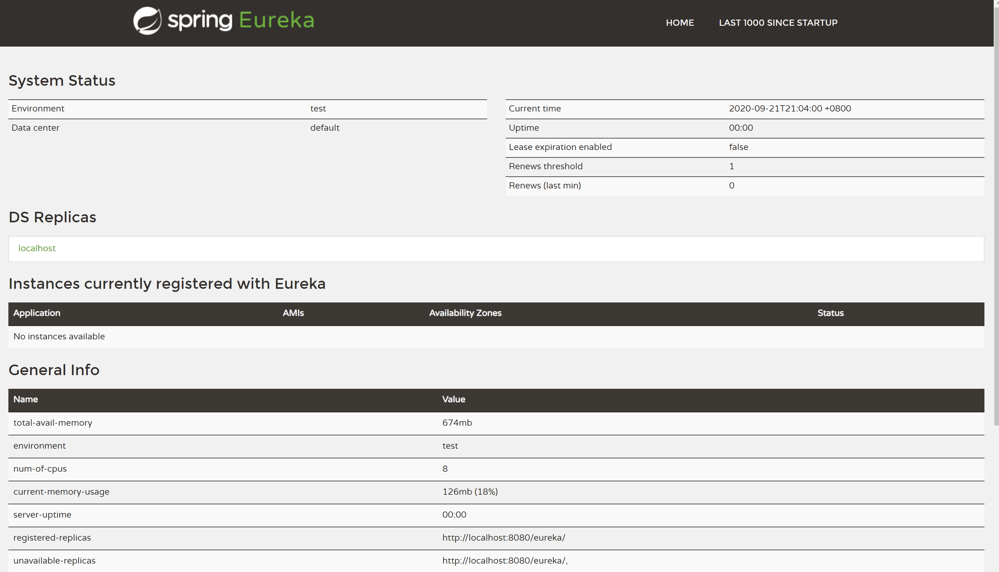

2. 至此Eureka Server配置完成

# 3. user-service
1. 项目目录

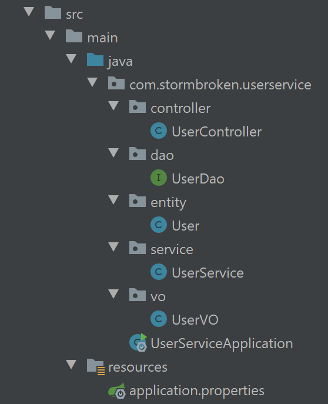

## 3.1. 创建项目
| 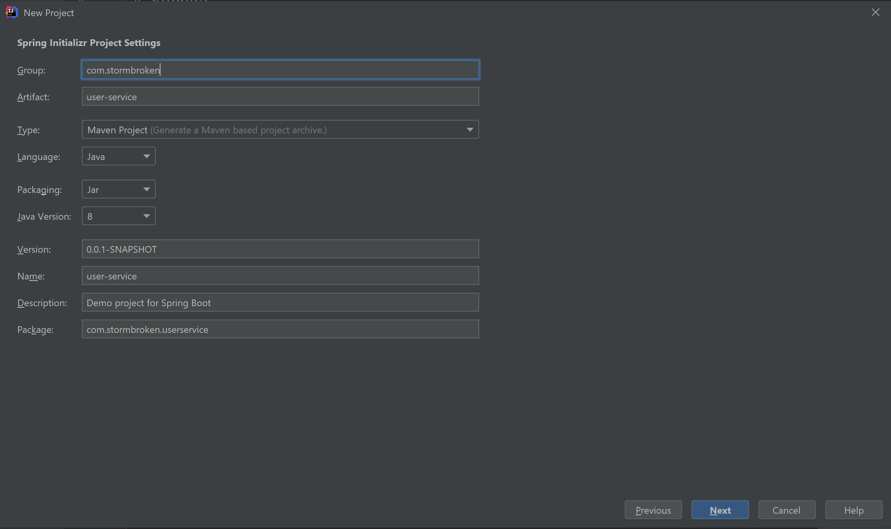 | 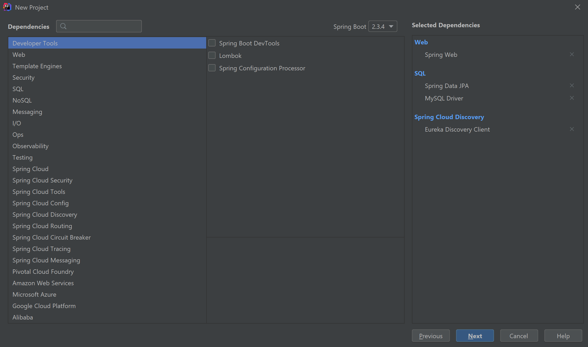 |
| -------------------- | -------------------- |

## 3.2. pom文件
```xml
<?xml version="1.0" encoding="UTF-8"?>
<project xmlns="http://maven.apache.org/POM/4.0.0" xmlns:xsi="http://www.w3.org/2001/XMLSchema-instance"
         xsi:schemaLocation="http://maven.apache.org/POM/4.0.0 https://maven.apache.org/xsd/maven-4.0.0.xsd">
    <modelVersion>4.0.0</modelVersion>
    <parent>
        <groupId>org.springframework.boot</groupId>
        <artifactId>spring-boot-starter-parent</artifactId>
        <version>2.3.1.RELEASE</version>
        <relativePath/> <!-- lookup parent from repository -->
    </parent>
    <groupId>com.stormbroken</groupId>
    <artifactId>user-service</artifactId>
    <version>0.0.1-SNAPSHOT</version>
    <name>user-service</name>
    <description>Demo project for Spring Boot</description>

    <properties>
        <java.version>1.8</java.version>
        <spring-cloud.version>Hoxton.SR6</spring-cloud.version>
    </properties>

    <dependencies>
        <dependency>
            <groupId>org.springframework.boot</groupId>
            <artifactId>spring-boot-starter-web</artifactId>
        </dependency>
        <dependency>
            <groupId>org.springframework.cloud</groupId>
            <artifactId>spring-cloud-starter-netflix-eureka-client</artifactId>
        </dependency>

        <dependency>
            <groupId>mysql</groupId>
            <artifactId>mysql-connector-java</artifactId>
            <scope>runtime</scope>
        </dependency>

        <dependency>
            <groupId>org.springframework.boot</groupId>
            <artifactId>spring-boot-starter-data-jpa</artifactId>
        </dependency>

        <dependency>
            <groupId>org.springframework.boot</groupId>
            <artifactId>spring-boot-starter-test</artifactId>
            <scope>test</scope>
            <exclusions>
                <exclusion>
                    <groupId>org.junit.vintage</groupId>
                    <artifactId>junit-vintage-engine</artifactId>
                </exclusion>
            </exclusions>
        </dependency>
    </dependencies>

    <dependencyManagement>
        <dependencies>
            <dependency>
                <groupId>org.springframework.cloud</groupId>
                <artifactId>spring-cloud-dependencies</artifactId>
                <version>${spring-cloud.version}</version>
                <type>pom</type>
                <scope>import</scope>
            </dependency>
        </dependencies>
    </dependencyManagement>

    <build>
        <plugins>
            <plugin>
                <groupId>org.springframework.boot</groupId>
                <artifactId>spring-boot-maven-plugin</artifactId>
            </plugin>
        </plugins>
    </build>

</project>

```

## 3.3. 配置application.properties
```properties
# 设置应用名
spring.application.name=user-service
# 设置端口号
server.port=9000
# Eureka，和 Eureka-Server项目保持一致
eureka.client.service-url.defaultZone=http://localhost:8080/eureka/
# 数据库表
spring.datasource.driver-class-name=com.mysql.cj.jdbc.Driver
spring.datasource.url=jdbc:mysql://localhost:3306/user?serverTimezone=GMT%2B8&useUnicode=true&charset=utf8mb4&useSSL=false
spring.datasource.username=root
spring.datasource.password=root
# JPA
spring.jpa.database-platform=org.hibernate.dialect.MySQL8Dialect
spring.jpa.show-sql=true
spring.jpa.hibernate.ddl-auto=update
```

## 3.4. UserServiceApplication
```java
package com.stormbroken.userservice;

import org.springframework.boot.SpringApplication;
import org.springframework.boot.autoconfigure.SpringBootApplication;
import org.springframework.cloud.netflix.eureka.EnableEurekaClient;

@SpringBootApplication
// 启动作为Euraka的客户机
@EnableEurekaClient
public class UserServiceApplication {

    public static void main(String[] args) {
        SpringApplication.run(UserServiceApplication.class, args);
    }

}
```

## 3.5. 创建entity/User.java
```java
package com.stormbroken.userservice.entity;

import javax.persistence.*;

/**
 * @Author stormbroken
 * Create by 2020/09/21
 * @Version 1.0
 **/
@Entity
@Table(name = "user")
public class User {
    @Id
    @GeneratedValue(strategy= GenerationType.AUTO)
    private long id;

    @Column(length = 32)
    private String name;

    @Column(length = 64)
    private String pwd;

    public long getId() {
        return id;
    }

    public void setId(long id) {
        this.id = id;
    }

    public String getName() {
        return name;
    }

    public void setName(String name) {
        this.name = name;
    }

    public String getPwd() {
        return pwd;
    }

    public void setPwd(String pwd) {
        this.pwd = pwd;
    }
}
```

## 3.6. 创建dao/UserDao.java
```java
package com.stormbroken.userservice.dao;

import com.stormbroken.userservice.entity.User;
import org.springframework.data.jpa.repository.JpaRepository;
import org.springframework.stereotype.Repository;

/**
 * @Author stormbroken
 * Create by 2020/09/21
 * @Version 1.0
 **/

@Repository
public interface UserDao extends JpaRepository<User, Long> {
}

```

## 3.7. 创建service/UserService.java
```java
package com.stormbroken.userservice.service;

import com.stormbroken.userservice.dao.UserDao;
import com.stormbroken.userservice.entity.User;
import org.springframework.beans.factory.annotation.Autowired;
import org.springframework.stereotype.Service;

import java.util.List;

/**
 * @Author stormbroken
 * Create by 2020/09/21
 * @Version 1.0
 **/

@Service
public class UserService {

    @Autowired
    private UserDao userDao;

    public User add(User user){
        User result = userDao.save(user);
        return result;
    }

    public List<User> getAllUser(){
        return userDao.findAll();
    }
}
```

## 3.8. 创建vo/UserVO
```java
package com.stormbroken.userservice.vo;

import javax.validation.constraints.NotBlank;

/**
 * @Author stormbroken
 * Create by 2020/09/21
 * @Version 1.0
 **/

public class UserVO {
    @NotBlank(message = "用户名不能为空")
    private String name;

    @NotBlank(message = "密码不能为空")
    private String pwd;

    public String getName() {
        return name;
    }

    public void setName(String name) {
        this.name = name;
    }

    public String getPwd() {
        return pwd;
    }

    public void setPwd(String pwd) {
        this.pwd = pwd;
    }
}
```

## 3.9. 创建controller/UserController
```java
package com.stormbroken.userservice.controller;

import com.stormbroken.userservice.entity.User;
import com.stormbroken.userservice.service.UserService;
import com.stormbroken.userservice.vo.UserVO;
import org.springframework.beans.factory.annotation.Autowired;
import org.springframework.web.bind.annotation.GetMapping;
import org.springframework.web.bind.annotation.PostMapping;
import org.springframework.web.bind.annotation.RequestBody;
import org.springframework.web.bind.annotation.RestController;

import javax.validation.Valid;

/**
 * @Author stormbroken
 * Create by 2020/09/21
 * @Version 1.0
 **/

@RestController
public class UserController {

    @Autowired
    private UserService userService;

    @PostMapping("/user")
    public Object add(@Valid @RequestBody UserVO userVO){
        User user = new User();
        user.setName(userVO.getName());
        user.setPwd(userVO.getPwd());
        return userService.add(user);
    }

    @GetMapping("/allUser")
    public Object getAllUser(){
        return userService.getAllUser();
    }
}
```

## 3.10. 测试是否能正常运行
1. 如下图的结果是正常的

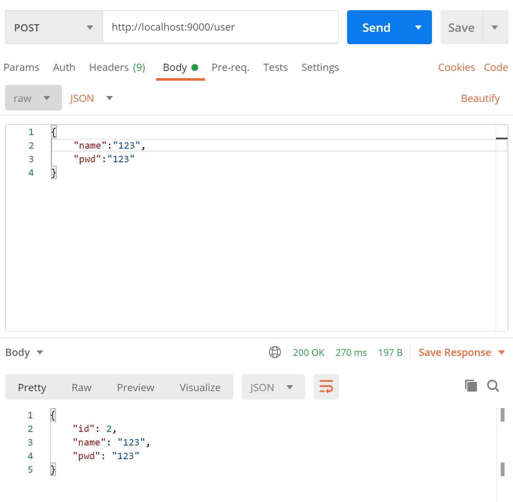

# 4. admin-service
1. 项目目录


## 4.1. 创建项目
| 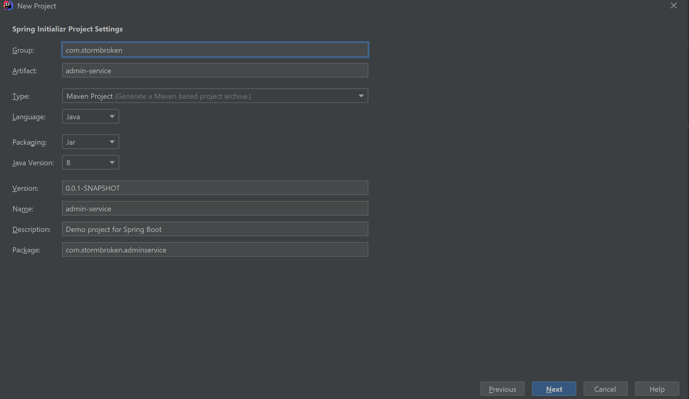 | 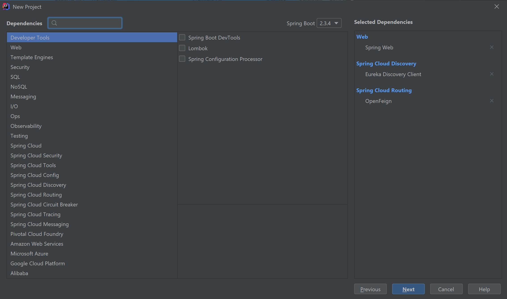 |
| -------------------- | -------------------- |

## 4.2. pom文件
```xml
<?xml version="1.0" encoding="UTF-8"?>
<project xmlns="http://maven.apache.org/POM/4.0.0" xmlns:xsi="http://www.w3.org/2001/XMLSchema-instance"
         xsi:schemaLocation="http://maven.apache.org/POM/4.0.0 https://maven.apache.org/xsd/maven-4.0.0.xsd">
    <modelVersion>4.0.0</modelVersion>
    <parent>
        <groupId>org.springframework.boot</groupId>
        <artifactId>spring-boot-starter-parent</artifactId>
        <version>2.3.1.RELEASE</version>
        <relativePath/> <!-- lookup parent from repository -->
    </parent>
    <groupId>com.stormbroken</groupId>
    <artifactId>admin-service</artifactId>
    <version>0.0.1-SNAPSHOT</version>
    <name>admin-service</name>
    <description>Demo project for Spring Boot</description>

    <properties>
        <java.version>1.8</java.version>
        <spring-cloud.version>Hoxton.SR6</spring-cloud.version>
    </properties>

    <dependencies>
        <dependency>
            <groupId>org.springframework.boot</groupId>
            <artifactId>spring-boot-starter-web</artifactId>
        </dependency>
        <dependency>
            <groupId>org.springframework.cloud</groupId>
            <artifactId>spring-cloud-starter-netflix-eureka-client</artifactId>
        </dependency>
        <dependency>
            <groupId>org.springframework.cloud</groupId>
            <artifactId>spring-cloud-starter-openfeign</artifactId>
        </dependency>

        <dependency>
            <groupId>org.springframework.boot</groupId>
            <artifactId>spring-boot-starter-test</artifactId>
            <scope>test</scope>
            <exclusions>
                <exclusion>
                    <groupId>org.junit.vintage</groupId>
                    <artifactId>junit-vintage-engine</artifactId>
                </exclusion>
            </exclusions>
        </dependency>
    </dependencies>

    <dependencyManagement>
        <dependencies>
            <dependency>
                <groupId>org.springframework.cloud</groupId>
                <artifactId>spring-cloud-dependencies</artifactId>
                <version>${spring-cloud.version}</version>
                <type>pom</type>
                <scope>import</scope>
            </dependency>
        </dependencies>
    </dependencyManagement>

    <build>
        <plugins>
            <plugin>
                <groupId>org.springframework.boot</groupId>
                <artifactId>spring-boot-maven-plugin</artifactId>
            </plugin>
        </plugins>
    </build>

</project>
```

## 4.3. 配置`application.properties`文件
```properties
spring.application.name=admin-service
server.port=8081

eureka.client.service-url.defaultZone=http://localhost:8080/eureka/
```

## 4.4. 修改入口类
```java
package com.stormbroken.adminservice;

import org.springframework.boot.SpringApplication;
import org.springframework.boot.autoconfigure.SpringBootApplication;
import org.springframework.cloud.client.discovery.EnableDiscoveryClient;
import org.springframework.cloud.openfeign.EnableFeignClients;

@SpringBootApplication
// 必须要用这个才会去找客户机
@EnableDiscoveryClient
// 必须要使用如下注册才能找到客户机
@EnableFeignClients
public class AdminServiceApplication {

    public static void main(String[] args) {
        SpringApplication.run(AdminServiceApplication.class, args);
    }

}
```

## 4.5. 首先创建vo/UserVO.java
```java
package com.stormbroken.adminservice.vo;

import javax.validation.constraints.NotBlank;

/**
 * @Author stormbroken
 * Create by 2020/09/21
 * @Version 1.0
 **/

public class UserVO {
    @NotBlank(message = "用户名不能为空")
    private String name;
    @NotBlank(message = "密码不能为空")
    private String pwd;

    public String getName() {
        return name;
    }

    public void setName(String name) {
        this.name = name;
    }

    public String getPwd() {
        return pwd;
    }

    public void setPwd(String pwd) {
        this.pwd = pwd;
    }
}
```

## 4.6. 重要:创建feign/UserFeign.java
```java
package com.stormbroken.adminservice.feign;

import com.stormbroken.adminservice.vo.UserVO;
import org.springframework.cloud.openfeign.FeignClient;
import org.springframework.stereotype.Component;
import org.springframework.web.bind.annotation.GetMapping;
import org.springframework.web.bind.annotation.PostMapping;

/**
 * @Author stormbroken
 * Create by 2020/09/21
 * @Version 1.0
 **/

@Component
// 根据之前设置的application.name来查找客户机
@FeignClient("user-service")
public interface UserFeign {
    // 向客户机发起请求
    @PostMapping("/user")
    Object add(UserVO userVO);

    @GetMapping("/allUser")
    Object findAllUsers();
}
```

## 4.7. 创建service/UserService
```java
package com.stormbroken.adminservice.service;

import com.stormbroken.adminservice.feign.UserFeign;
import com.stormbroken.adminservice.vo.UserVO;
import org.springframework.beans.factory.annotation.Autowired;
import org.springframework.stereotype.Service;

/**
 * @Author stormbroken
 * Create by 2020/09/21
 * @Version 1.0
 **/

@Service
public class UserService {

    @Autowired
    private UserFeign userFeign;

    public Object add(UserVO userVO){
        //调用user-service中的服务
        return userFeign.add(userVO);
    }


    public Object getAllUsers() {
        return userFeign.findAllUsers();
    }
}
```

## 4.8. 创建controller/UserController
```java
package com.stormbroken.adminservice.controller;

import com.stormbroken.adminservice.service.UserService;
import com.stormbroken.adminservice.vo.UserVO;
import org.springframework.beans.factory.annotation.Autowired;
import org.springframework.web.bind.annotation.GetMapping;
import org.springframework.web.bind.annotation.PostMapping;
import org.springframework.web.bind.annotation.RequestBody;
import org.springframework.web.bind.annotation.RestController;

import javax.validation.Valid;

/**
 * @Author stormbroken
 * Create by 2020/09/21
 * @Version 1.0
 **/

@RestController
public class UserController {

    @Autowired
    private UserService userService;

    @PostMapping("/user")
    public Object add(@Valid @RequestBody UserVO userVO){
        return userService.add(userVO);
    }

    @GetMapping("/allUser")
    public Object getAllUsers(){
        return userService.getAllUsers();
    }

}
```

## 4.9. 测试效果
1. 首先启动Eureka-server
2. 然后启动user-service
3. 然后启动admin-service
4. 然后访问`http:localhost:8080`,查看Eureka面板

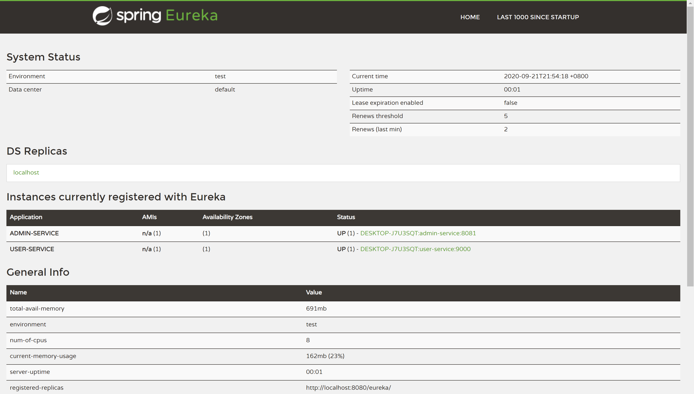

5. 通过admin-service调用user-service服务，成功结果如下

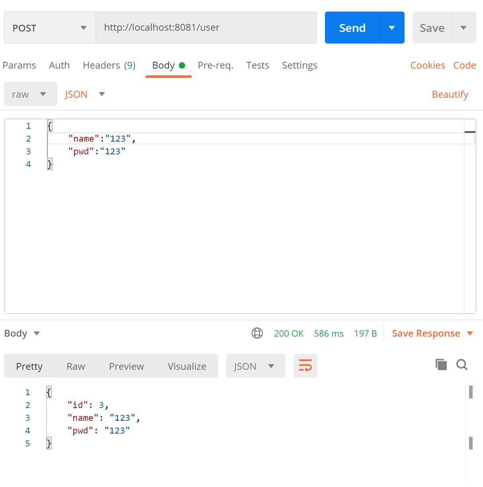

6. 通过admin-service查看所有用户,使用浏览器访问:`http://localhost:8081/allUser`，结果如下

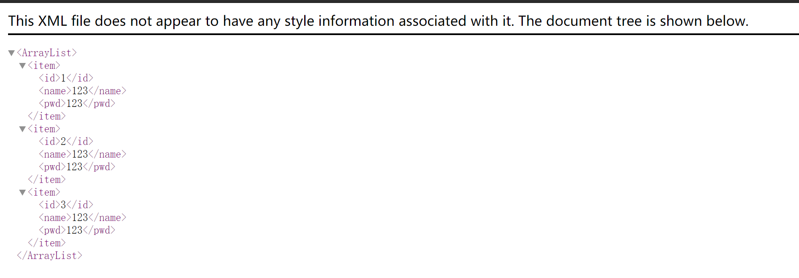
